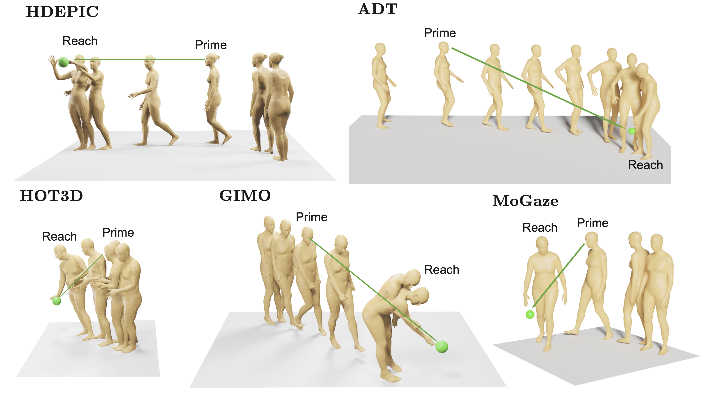

# Prime and Reach: Synthesising Body Motion for Gaze-Primed Object Reach

<div align="center">

[](https://arxiv.org/abs/2512.XXXXX)
[](https://masashi-hatano.github.io/prime-and-reach/)

</div>

**This is the official code releasse for "Prime and Reach: Synthesising Body Motion for Gaze-Primed Object Reach".**


The code will be available upon acceptance.


## Dataset Overview
We curate prime and reach sequences from 5 different datasets:
- **HD-EPIC**
- **MoGaze**
- **HOT3D**
- **ADT**
- **GIMO**



The dataset provides motion and gaze data across these sources.

You can download the dataset [here](https://uob-my.sharepoint.com/:f:/g/personal/ve22636_bristol_ac_uk/IgCGqhTjsmu8T6V1LJS8ydcFAVubcEW-b4UCIP60kIokv-w?e=6flrzW).

The data is organized by source dataset. Each dataset folder contains subdirectories for `motions` and `gazes`.

```text
root/
├── HD-EPIC/
│   ├── motions/
│   ├── gazes/
│   └── target_information.json
├── MoGaze/
│   ├── motions/
│   ├── gazes/
│   └── target_information.json
├── HOT3D/
│   ├── motions/
│   ├── gazes/
│   └── target_information.json
├── ADT/
│   ├── motions/
│   ├── gazes/
│   └── target_information.json
└── GIMO/
    ├── motions/
    ├── gazes/
    └── target_information.json
````

The `motions` folder has 22 joint position data for each sequence in the data. It comprises of motion sequences as from  `0000000000.npy,0000000001.npy,...` where each `npy` file corresponds to an unique sequence. The motion data is shaped as `Nx22x3` where N is the length of the sequence.
Note that our motion is +y-up, i.e. y-axis is the gravity axis.

Similarly `gazes` folder has the gaze information for each of the sequences `0000000000.npy,0000000001.npy,...`. They are also saved as `npy` files with shapes `Nx3` where the 3 values `x,y,z` represent the 3D unit vector in the gaze direction originating from the head joint.

The `target_information.json` has information related to the goal location, text prompt, train/test subset and primed frame number for each sequence. Each key in the json corresponds to each unique sequence under which we provide all the information.


## Code/Model

Coming Soon


## ✍️ Citation

If you find our work useful in your research, please consider citing:

```bibtex
@article{hatano2025primeandreach,
  title={Prime and Reach: Synthesising Body Motion for Gaze-Primed Object Reach},
  author={Hatano, Masashi and Sinha, Saptarshi and Chalk, Jacob and Li, Wei-Hong and Saito, Hideo and Damen, Dima},
  journal={arXiv preprint arxiv:2512.XXXXX},
  year={2025},
}
```

Since we use `HDEPIC, MoGaze, HOT3D, ADT, GIMO` to curate our sequences, you should cite each of the datasets as below
```bibtex
@inproceedings{Perrett_2025_CVPR,
    author={Perrett, Toby and Darkhalil, Ahmad and Sinha, Saptarshi and Emara, Omar and Pollard, Sam and Parida, Kranti Kumar and Liu, Kaiting and Gatti, Prajwal and Bansal, Siddhant and Flanagan, Kevin and Chalk, Jacob and Zhu, Zhifan and Guerrier, Rhodri and Abdelazim, Fahd and Zhu, Bin and Moltisanti, Davide and Wray, Michael and Doughty, Hazel and Damen, Dima},
    title={HD-EPIC: A Highly-Detailed Egocentric Video Dataset},
    booktitle={Proceedings of the IEEE/CVF Conference on Computer Vision and Pattern Recognition (CVPR)},
    month={June},
    year={2025},
    pages={23901-23913}
}
```
```bibtex
@article{Kratzer_2021,
  author={Kratzer, Philipp and Bihlmaier, Simon and Midlagajni, Niteesh Balachandra and Prakash, Rohit and Toussaint, Marc and Mainprice, Jim},
  journal={IEEE Robotics and Automation Letters}, 
  title={MoGaze: A Dataset of Full-Body Motions that Includes Workspace Geometry and Eye-Gaze}, 
  year={2021},
  volume={6},
  number={2},
  pages={367-373},
  keywords={Robots;Cameras;Task analysis;Tracking;Three-dimensional displays;Pupils;Linux;Datasets for human motion;human-centered robotics;modeling and simulating humans},
  doi={10.1109/LRA.2020.3043167}}
```
```bibtex
@inproceedings{Banerjee_2025_CVPR,
    author    = {Banerjee, Prithviraj and Shkodrani, Sindi and Moulon, Pierre and Hampali, Shreyas and Han, Shangchen and Zhang, Fan and Zhang, Linguang and Fountain, Jade and Miller, Edward and Basol, Selen and Newcombe, Richard and Wang, Robert and Engel, Jakob Julian and Hodan, Tomas},
    title     = {HOT3D: Hand and Object Tracking in 3D from Egocentric Multi-View Videos},
    booktitle = {Proceedings of the IEEE/CVF Conference on Computer Vision and Pattern Recognition (CVPR)},
    month     = {June},
    year      = {2025},
    pages     = {7061-7071}
}
```
```bibtex
@inproceedings{Pan_2023_ICCV,
    author    = {Pan, Xiaqing and Charron, Nicholas and Yang, Yongqian and Peters, Scott and Whelan, Thomas and Kong, Chen and Parkhi, Omkar and Newcombe, Richard and Ren, Yuheng (Carl)},
    title     = {Aria Digital Twin: A New Benchmark Dataset for Egocentric 3D Machine Perception},
    booktitle = {Proceedings of the IEEE/CVF International Conference on Computer Vision (ICCV)},
    month     = {October},
    year      = {2023},
    pages     = {20133-20143}
}
```
```bibtex
@inproceedings{zheng2022gimo,
  title={Gimo: Gaze-informed human motion prediction in context},
  author={Zheng, Yang and Yang, Yanchao and Mo, Kaichun and Li, Jiaman and Yu, Tao and Liu, Yebin and Liu, C Karen and Guibas, Leonidas J},
  booktitle={European Conference on Computer Vision},
  pages={676--694},
  year={2022},
  organization={Springer}
}
```